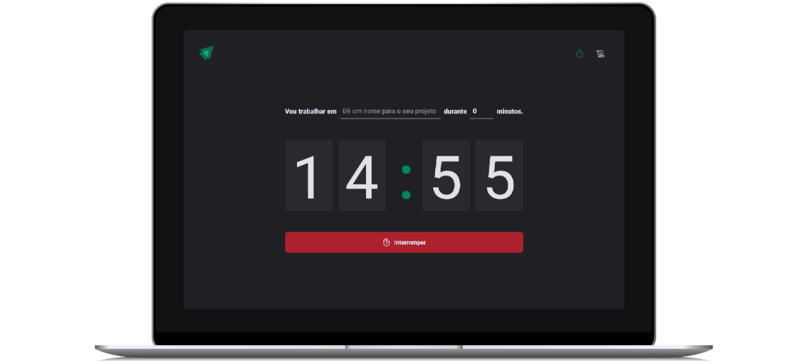

# Projeto Ignite Time | Rocketseat

### Veja o projeto online

🚀 [Link do projeto online]()

### Tecnologias Utilizadas

- React com Vite: ^18.3.1
- Typescript: ^5.2.2

### Funcionalidades

- Pode cadasatrar um novo projeto com nome e tempo de desenvolvimento;
- Pode para esse projeto em execução;
- Na área de listagem, pode verificar todos os projetos que já trabalho com o devido status de cada projeto;
- Gravando os cyclos em localStorage;

### Aprendizado

- styled-components;
- Roteamento com React Autodown';
- Contextos;
- Reducers;
- Immer;
- React Hook Form;
- Validação utilizando o Hook Form Resolvers e Zod;
- Fornatação de datas e hora com date-fns;

### Bibliotecas

Biblioteca para auxiliar o estilo em css do projeto

```
npm i styled-components
npm i @types/styled-components -D
```

Biblioteca Eslint

```
npm i eslint -D
```

Biblioteca as configurações da Rocketseat do eslint, não esqueça de baixar a estenção do Eslint e deixar a pasta .vscode no seu projeto.

```
npm i @rocketseat/eslint-config -D
```

Biblioteca de rotas no projeto

```
npm i react-router-dom
```

Biblioteca de icones para o projeto: https://phosphoricons.com/

```
npm i phosphor-react
```

Biblioteca de formulários

```
npm i react-hook-form
```

Biblioteca de validação de formulários

```
npm i zod
```

Biblioteca para intregar a zod com a Hook form

```
npm i @hookform/resolvers
```

Biblioteca para trabalhar com datas e tempo

```
npm i date-fns
```

Biblioteca para trabalhar com dados imutavies

```
npm i immer
```

### Comandos

Comando para vasculhar erros do eslint no código

```
npx eslint src --ext .ts, .tsx
```

Comando para corrir todos os erros no eslint automaticamente em todo o projeto.

```
npx eslint src --ext .ts, .tsx --fix
```

### Como Executar o Projeto

1. Clone o repositório:

   ```bash
   git clone https://github.com/fabiocasadossites/react-igniteTime-rocketseat.git
   ```

2. Navegue até o diretório do projeto:

   ```bash
   cd nome-do-repositorio
   ```

3. Atualize o projeto, Em seu terminal e na pasta do projeto

   ```bash
   npm install
   ```

4. Rodar o projeto

   ```bash
   npm run dev
   ```

<br>

## 👨‍💻 Expert

<p>
    
    <p>&nbsp&nbsp&nbspFabio Augusto<br>
    &nbsp&nbsp&nbsp
    <a href="https://github.com/fabiocasadossites">
    GitHub</a>&nbsp;|&nbsp;
    <a href="https://www.linkedin.com/in/fabioasa/">LinkedIn</a>
&nbsp;|&nbsp;
    <a href="https://www.fabioaugusto.dev/">
    Portfolio </a>
&nbsp;&nbsp;</p>
</p>
<br/>
<p>

💻 com ❤️ por [Fabio Augusto](https://github.com/fabiocasadossites)
